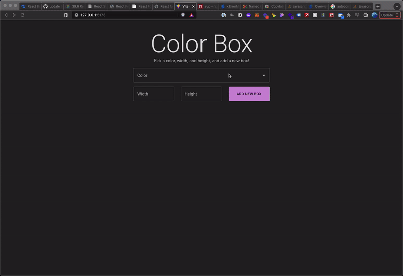

# Color Box App

This app generates a box that you can create by choosing the box's color, width, and height. The

This app uses [React](https://reactjs.org/docs/getting-started.html) and [Material UI](https://mui.com/) for front-end rendering, [Formik](https://formik.org/) for form handling, and [Yup](https://www.npmjs.com/package/yup) for form validation.

## App Demo


## Installation and Setup

```shell
npm install
npm run dev
```

Then run `localhost` to run the app locally.

## Testing
```shell
npm test
```